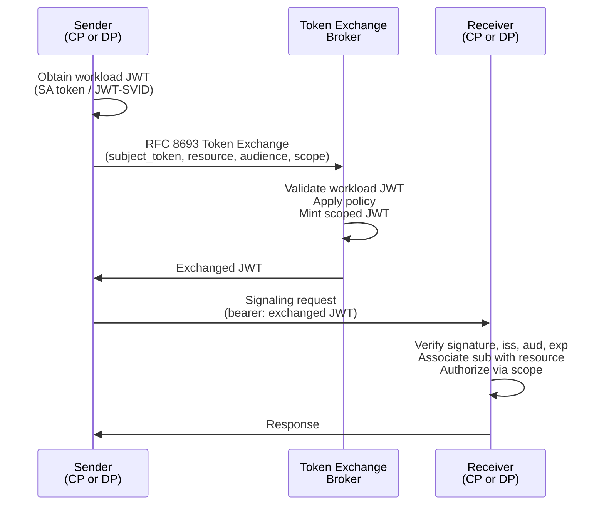

## Authorization Profiles

This section describes Authorization Profiles that can be used to authorize a [=Data Plane=] or [=Control Plane=]
registration. Implementations SHOULD use one of these profiles to ensure minimum interoperability and avoid defining 
custom authorization profiles. All Authorization Profiles are optional and not mandatory.

### OAuth 2 Client Credentials Grant

A [=Control Plane=] or [=Data Plane=] that supports the OAuth 2.0 Client Credentials Grant as is defined
in [RFC 6749](https://tools.ietf.org/html/rfc6749#section-4.4) uses an `oauth2_client_credentials` authorization profile
in its `authorization` object. This object contains the following properties:

|              |                                                                                                                                                                                          |
|--------------|------------------------------------------------------------------------------------------------------------------------------------------------------------------------------------------|
| **Schema**   | [JSON Schema](./resources/TBD)                                                                                                                                                           |
| **Required** | - `type`: Must be `oauth2_client_credentials`.                                                                                                                                           |
|              | - `tokenEndpoint`: The URL of the authorization server's token endpoint as defined in [RFC6749](https://datatracker.ietf.org/doc/html/rfc6749).                                          |
|              | - `clientId`: The OAuth2 client id used for the Client Credentials Grant.                                                                                                                |
|              | - `clientSecret`: The OAuth2 client secret used for the Client Credentials Grant.                                                                                                        |
| **Optional** | - `jwks`: A JSON Web Key Set ([RFC7517](https://datatracker.ietf.org/doc/html/rfc7517)) containing the public key(s) the receiving party MUST use to verify tokens issued by this party. |
|              | - `jwksUri`: A URL pointing to a JSON Web Key Set endpoint. The receiving party MAY fetch and cache the JWKS from this URL to verify tokens issued by this party.                        |

The way `jwks` and `jwksUri` are managed is implementation specific, but generally speaking they should never used at
the same time. If neither is provided, the receiving party skips signature verification. When a JWKS is present, the
receiving party MUST use the key whose `kid` matches the `kid` header claim of the incoming JWT. If no `kid` is present,
the receiving party MAY attempt verification with each key in the set.

The following is a non-normative example of an OAuth2 entry using an inline JWKS:

```json
{
  "authorization": {
    "type": "oauth2_client_credentials",
    "tokenEndpoint": "https://example.com/auth",
    "clientId": "1234567890",
    "clientSecret": "1234567890",
    "jwks": {
      "keys": [
        {
          "kty": "RSA",
          "kid": "key-2025-04",
          "use": "sig",
          "n": "...",
          "e": "AQAB"
        }
      ]
    }
  }
}
```

The following is a non-normative example using a JWKS URI:

```json
{
  "authorization": {
    "type": "oauth2_client_credentials",
    "tokenEndpoint": "https://example.com/auth",
    "clientId": "1234567890",
    "clientSecret": "1234567890",
    "jwksUri": "https://example.com/auth/.well-known/jwks.json"
  }
}
```

#### Token Claims {#client-credentials-token-claims}

Access tokens obtained via the Client Credentials Grant are self-signed JWTs. The issuing party signs the token with its
own private key. If a `jwks` or `jwksUri` was provided during registration, the receiving party MUST verify the token
signature using those public key (s). Otherwise, signature verification is skipped and verification is based solely on
the claims contained in the token.

The access token MUST be a JWT and MUST contain the following claims:

| Claim | Requirement | Description                                                                                                                                                            |
|-------|-------------|------------------------------------------------------------------------------------------------------------------------------------------------------------------------|
| `iss` | MUST        | Issuer of the token                                                                                                                                                    |
| `sub` | MUST        | The identifier of the issuing party. For a [=Data Plane=] token this MUST equal the `dataplaneId`; for a [=Control Plane=] token this MUST equal the `controlplaneId`. |
| `aud` | MUST        | The identifier of the target plane receiving the token.                                                                                                                |
| `iat` | MUST        | The time at which the token was issued (seconds since Unix epoch).                                                                                                     |
| `exp` | MUST        | The expiration time of the token (seconds since Unix epoch). Receiving parties MUST reject expired tokens.                                                             |
| `jti` | SHOULD      | A unique token identifier. Receiving parties SHOULD use this to detect and reject token replay attempts.                                                               |


### OAuth 2 Token Exchange

A [=Control Plane=] or [=Data Plane=] that obtains access tokens by exchanging a workload-layer credential (for example
a Kubernetes ServiceAccount token or a SPIFFE JWT-SVID) for a scoped JWT, as defined in
[RFC 8693](https://datatracker.ietf.org/doc/html/rfc8693), uses an `oauth2_token_exchange` authorization profile in its
`authorization` object.

This profile is positioned for deployments where the issuing party does not run a self-signing authorization server.
Instead, a **token exchange broker** validates a workload-layer credential, applies policy to map it to a
signaling-layer principal, and mints a scoped JWT that the issuing party presents to the receiving party. The
workload-layer credential never travels to the receiving party.

The `authorization` object contains the following properties:

|              |                                                                                                                                                                                                                                         |
|--------------|-----------------------------------------------------------------------------------------------------------------------------------------------------------------------------------------------------------------------------------------|
| **Schema**   | [JSON Schema](./resources/TBD)                                                                                                                                                                                                          |
| **Required** | - `type`: Must be `oauth2_token_exchange`.                                                                                                                                                                                              |
|              | - `tokenExchangeEndpoint`: The URL of the broker's token exchange endpoint as defined in [RFC 8693](https://datatracker.ietf.org/doc/html/rfc8693).                                                                                     |
|              | - `issuer`: The expected `iss` claim of tokens minted by the broker. The receiving party MUST reject tokens whose `iss` does not match this value.                                                                                      |
|              | - `jwksUri`: A URL pointing to the broker's JSON Web Key Set ([RFC7517](https://datatracker.ietf.org/doc/html/rfc7517)) endpoint. The receiving party fetches and caches the JWKS from this URL to verify tokens issued by this broker. |

Inline JSON Web Key Sets are not permitted for this profile; the broker's keys MUST be served from `jwksUri`. The
receiving party MUST verify the signature of every incoming JWT against the keys obtained from `jwksUri`; signature
verification MUST NOT be skipped. The receiving party MUST use the key whose `kid` matches the `kid` header claim of the
incoming JWT. If no `kid` is present, the receiving party MAY attempt verification with each key in the set.

The `authorization` object does not carry the list of principals the issuing party may act as. The set of valid
principals is known to the receiving party out-of-band; the receiving party associates each incoming request with the
correct resource by reading the `sub` and `participant_context` claims of the presented JWT.

The following is a non-normative example using a JWKS URI:

```json
{
  "authorization": {
    "type": "oauth2_token_exchange",
    "metadataEndpoint": "https://broker.example.com/auth/.well-known/oauth-authorization-server"
  }
}
```

#### Principal Resource

A **Principal Resource** is a URI-named principal that an exchanged JWT speaks for. Defining it as a resource gives the
`sub` claim of exchanged JWTs agreed semantics across implementations.

A Principal Resource has the following normative properties:

|              |                                                                                                                                |
|--------------|--------------------------------------------------------------------------------------------------------------------------------|
| **Required** | - `id`: An absolute URI. The `sub` claim of any JWT exchanged for this principal MUST equal this URI verbatim.                 |
|              | - `participantContextId`: The participant context this principal acts within. Semantics are deferred to the participant layer. |

Implementations MAY attach additional properties (for example display metadata, allowed scopes, or constraints on which
workload identities may be exchanged for this principal); this specification does not constrain them. Only the `id`
crosses the wire, as the `sub` of the exchanged JWT.

The URI scheme of `id` is unconstrained. Implementations MAY use `urn:`, opaque `https:` URIs, or resolvable HTTP
endpoints. Whether the URI is dereferenceable is a deployment choice.

#### Workload Credential

The issuing party authenticates to the broker by presenting a **workload credential**: a JWT minted by the workload
runtime that proves the identity of the process performing the exchange. This specification defines two workload
credential types: Kubernetes ServiceAccount tokens and SPIFFE JWT-SVIDs. A broker MAY support either, both, or
additional workload credential types via implementation-specific extension.

A workload credential MUST be a JWT and MUST contain the following claims:

| Claim | Requirement | Description                                                                                                                                                                                                            |
|-------|-------------|------------------------------------------------------------------------------------------------------------------------------------------------------------------------------------------------------------------------|
| `iss` | MUST        | Issuer of the workload credential (the cluster OIDC issuer or SPIFFE trust domain authority).                                                                                                                          |
| `sub` | MUST        | The workload identity (for example a ServiceAccount subject or SPIFFE ID). The broker maps this value to a [Principal Resource](#principal-resource).                                                                  |
| `aud` | MUST        | MUST contain the broker's `tokenExchangeEndpoint` value, or another broker-designated audience identifier configured out-of-band. The broker MUST reject workload credentials whose `aud` does not include this value. |
| `exp` | MUST        | Expiration time. The broker MUST reject expired workload credentials.                                                                                                                                                  |

##### Kubernetes ServiceAccount Tokens

When the workload runs in Kubernetes, the workload credential is a
[projected ServiceAccount token](https://kubernetes.io/docs/concepts/configuration/secret/#service-account-token-secrets).
The token is obtained by mounting a `projected` volume of type `serviceAccountToken` with the `audience` field set to
the broker's audience identifier. The workload reads the token from the mounted path and presents it to the broker.

The `subject_token_type` for a Kubernetes ServiceAccount token is
`urn:ietf:params:oauth:token-type:jwt`. The token's `sub` claim takes the form
`system:serviceaccount:<namespace>:<serviceaccount>`, and its `iss` claim is the cluster's OIDC issuer URL.

##### SPIFFE JWT-SVIDs

When the workload is provisioned with a SPIFFE identity, the workload credential is a JWT-SVID obtained by calling
[`FetchJWTSVID`](https://github.com/spiffe/spiffe/blob/main/standards/SPIFFE_Workload_API.md) on the local SPIFFE
Workload API with the audience set to the broker's audience identifier.

The `subject_token_type` for a JWT-SVID is `urn:ietf:params:oauth:token-type:jwt`. The token's `sub` claim is the SPIFFE
ID (e.g. `spiffe://prod.acme/ns/dp/sa/data-plane`) and its `iss` claim is the SPIFFE trust domain authority.

#### Exchange Request

To obtain a scoped JWT, the issuing party performs an RFC 8693 token exchange against `tokenExchangeEndpoint`,
presenting its workload credential as the `subject_token` and naming the target Principal Resource using the
`resource` parameter defined in [RFC 8707](https://datatracker.ietf.org/doc/html/rfc8707):

```http
POST /token HTTP/1.1
Host: broker.example.com
Content-Type: application/x-www-form-urlencoded

grant_type=urn:ietf:params:oauth:grant-type:token-exchange
&subject_token=<workload-jwt>
&subject_token_type=urn:ietf:params:oauth:token-type:jwt
&resource=<principal-resource-uri>
&audience=<receiver-identifier>
&scope=<space-separated-scopes>
&requested_token_type=urn:ietf:params:oauth:token-type:jwt
```

The request parameters are:

| Parameter              | Requirement | Description                                                                                                                       |
|------------------------|-------------|-----------------------------------------------------------------------------------------------------------------------------------|
| `grant_type`           | MUST        | The fixed value `urn:ietf:params:oauth:grant-type:token-exchange`.                                                                |
| `subject_token`        | MUST        | The workload credential JWT.                                                                                                      |
| `subject_token_type`   | MUST        | The fixed value `urn:ietf:params:oauth:token-type:jwt`.                                                                           |
| `resource`             | MUST        | The `id` URI of the target Principal Resource the exchanged token will speak for.                                                 |
| `audience`             | MUST        | The identifier of the receiving party that will consume the exchanged token. Becomes the `aud` claim of the minted JWT.           |
| `scope`                | SHOULD      | Space-separated scopes the issuing party requests. The broker MAY grant a narrower set per its policy.                            |
| `requested_token_type` | SHOULD      | The fixed value `urn:ietf:params:oauth:token-type:jwt`. Brokers MUST mint a JWT regardless of whether this parameter is supplied. |

The issuing party MUST NOT include client authentication credentials (`client_id`, `client_secret`, etc.). The workload
credential is the sole proof of identity to the broker.

#### Broker Behavior

On receiving an exchange request the broker MUST, in order:

1. **Parse and verify the workload credential signature** against the keys published by the workload credential's `iss`.
   For Kubernetes ServiceAccount tokens, the broker discovers the cluster's signing keys via OIDC discovery at
   `<iss>/.well-known/openid-configuration`. For SPIFFE JWT-SVIDs, the broker uses the trust bundle of the SPIFFE trust
   domain identified by `iss`. The broker MUST maintain a configured set of trusted workload issuers and MUST reject any
   workload credential whose `iss` is not in that set.
2. **Validate workload credential claims**: `exp` not passed, `aud` contains the broker's configured audience
   identifier.
3. **Resolve the `resource` parameter** to a Principal Resource known to the broker. The broker MUST reject the request
   if the URI is unknown to it.
4. **Apply policy** to decide whether the workload identity (`subject_token.sub`, optionally qualified by `iss`) is
   permitted to act as the named Principal Resource. How this mapping is configured (static table, policy engine,
   directory lookup) is implementation-defined.
5. **Intersect requested scopes** against the set of scopes the broker policy permits for this (workload, principal)
   pair. If the resulting set is empty and `scope` was requested, the broker SHOULD reject the request.
6. **Mint and sign** a JWT containing the claims defined under [Token Claims](#token-exchange-token-claims), signed with a key
   advertised at the broker's `jwksUri`.

If any step fails, the broker MUST respond with an RFC 6749 error response. Use of the
`invalid_request`, `invalid_grant`, `invalid_target`, and `unauthorized_client` codes is RECOMMENDED.

#### Exchange Response

On success the broker returns an RFC 8693 token-exchange response:

```http
HTTP/1.1 200 OK
Content-Type: application/json
Cache-Control: no-store

{
  "access_token": "<exchanged-jwt>",
  "issued_token_type": "urn:ietf:params:oauth:token-type:jwt",
  "token_type": "Bearer",
  "expires_in": 300,
  "scope": "signaling:dataflow"
}
```

The `scope` field MUST reflect the scopes actually granted, which MAY be narrower than the scopes requested. The
`expires_in` value is advisory; the authoritative expiry is the `exp` claim of the minted JWT.

#### Token Rotation

Exchanged tokens are short-lived. The issuing party SHOULD obtain a fresh exchanged token before its `exp` and MUST NOT
reuse an expired token. Implementations SHOULD cache exchanged tokens keyed by `(resource, audience, scope)` for the
lifetime of the token to avoid per-request exchanges.

Workload credentials are themselves short-lived and rotate independently of exchanged tokens. The issuing party MUST
re-read the workload credential from its source (projected volume, Workload API) before each exchange to ensure it
presents a non-expired credential to the broker.

#### Token Claims {#token-exchange-token-claims}

Tokens obtained via the Token Exchange are JWTs signed by the broker. The receiving party MUST verify every token's
signature using the keys obtained from the registered `jwksUri`.

The access token MUST be a JWT and MUST contain the following claims:

| Claim                 | Requirement | Description                                                                                                                                                                                  |
|-----------------------|-------------|----------------------------------------------------------------------------------------------------------------------------------------------------------------------------------------------|
| `iss`                 | MUST        | Issuer of the token. MUST equal the `issuer` registered in the `authorization` object.                                                                                                       |
| `sub`                 | MUST        | The `id` URI of the Principal Resource this token speaks for.                                                                                                                                |
| `aud`                 | MUST        | The identifier of the target plane receiving the token.                                                                                                                                      |
| `scope`               | MUST        | The scopes granted by the broker. The receiving party MUST use this claim to authorize the requested operation.                                                                              |
| `participant_context` | MUST        | Mirrors the `participantContextId` of the Principal Resource named by `sub`. Allows the receiving party to associate the request with a participant context without resolving `sub`.         |
| `iat`                 | MUST        | The time at which the token was issued (seconds since Unix epoch).                                                                                                                           |
| `exp`                 | MUST        | The expiration time of the token (seconds since Unix epoch). Receiving parties MUST reject expired tokens.                                                                                   |
| `jti`                 | SHOULD      | A unique token identifier. Receiving parties SHOULD use this to detect and reject token replay attempts.                                                                                     |
| `act`                 | MAY         | The RFC 8693 actor claim, preserving the workload identity that authorized the exchange. Provided for audit purposes. Receiving parties MUST NOT use this claim for authorization decisions. |

#### Receiver Validation

On every incoming request, the receiving party MUST:

1. Verify the JWT signature against the keys obtained from the registered `jwksUri`.
2. Verify that `iss` equals the registered `issuer`.
3. Verify that `aud` equals the receiving party's own identifier.
4. Verify that `exp` has not passed, and apply replay detection using `jti` where supported.
5. Associate the request with the resource named by `sub`, and use `scope` to authorize the requested operation against
   that resource.

The receiving party does not consult an enumerated principal list during validation. Authorization reduces to "does this
`sub` plus `scope` permit this operation on this resource?", which the receiving party answers using its own knowledge
of valid principals.


